sentinel:

是什么：
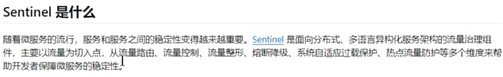

流程：
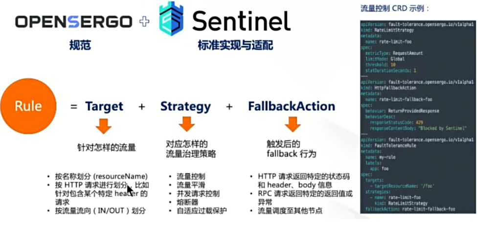

主要特性：
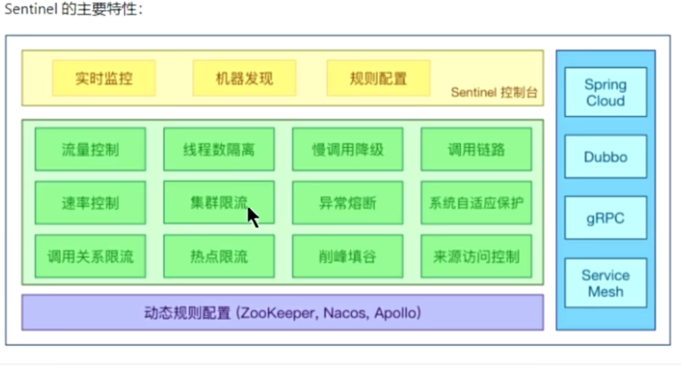

组成：
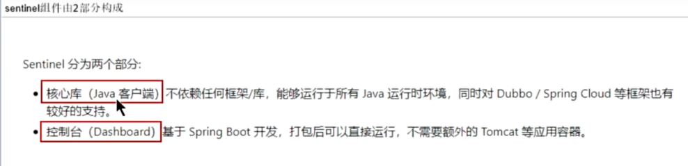

sentinel: 使用控制台配置
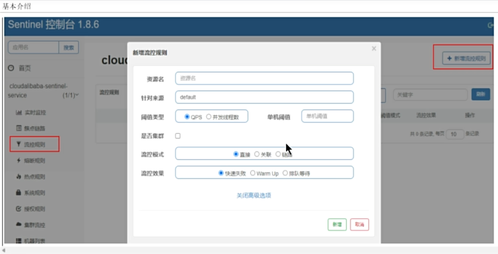

流空规则

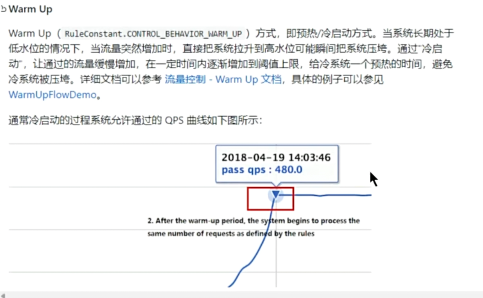

熔断规则

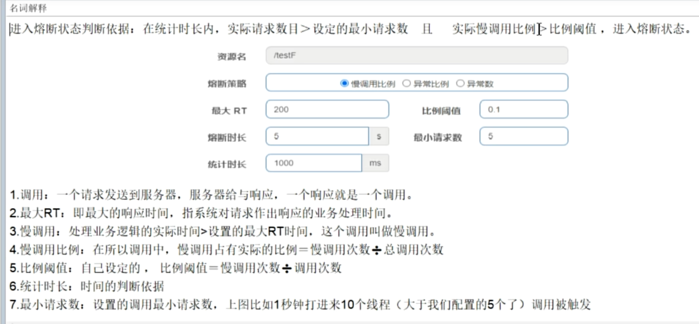

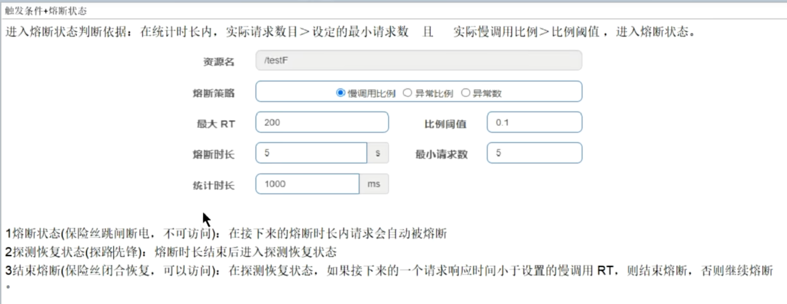

图形配置和代码关系

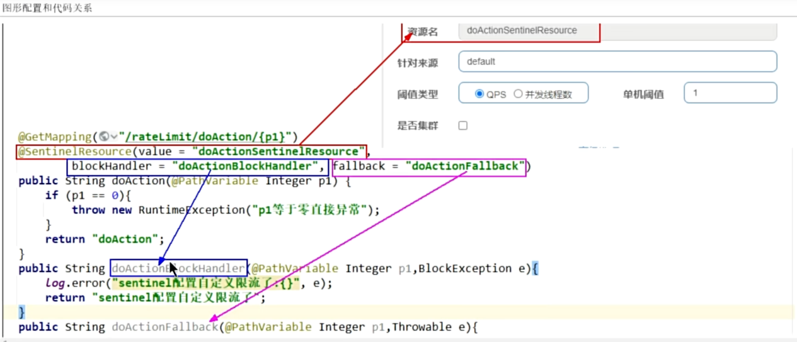

热点限流：
控制参数，如果参数符合进行限流

授权规则概述

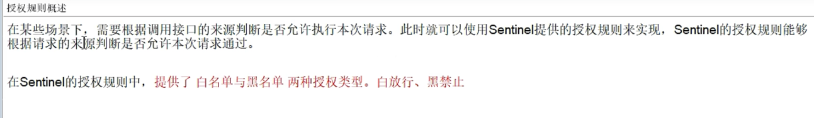

规则持久化

规则控制类型

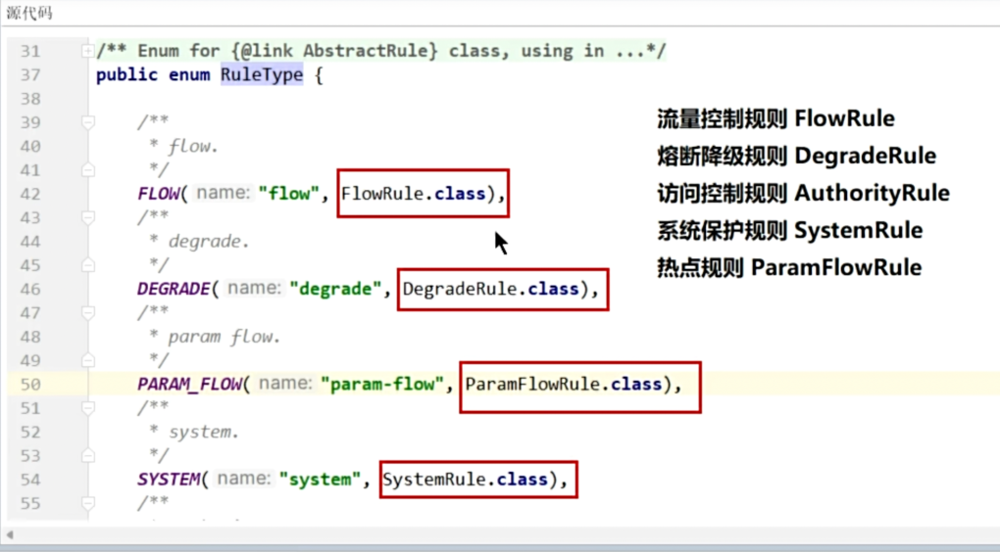

持久化配置：

[
{
"resource": "/rateLimit/byUrl",
"limitApp": "default",
"grade": 1,
"count": 1,
"strategy": 0,
"controlBehavior": 0,
"clusterMode": false
}
]

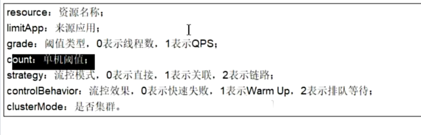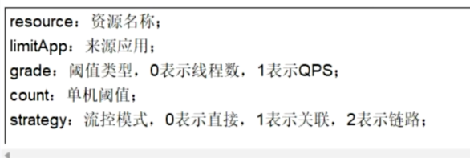

sentinel 整合 openFeign :
报错统一返回处理：
1.feign 注解 配置
2.sentinel 配置
版本不兼容，要该 boot - cloud 版本

gateWay 和 sentinel 集成实现服务限流：

只是一个简单的例子

