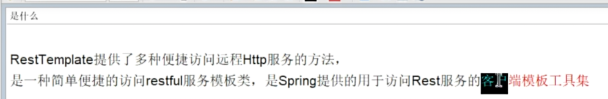
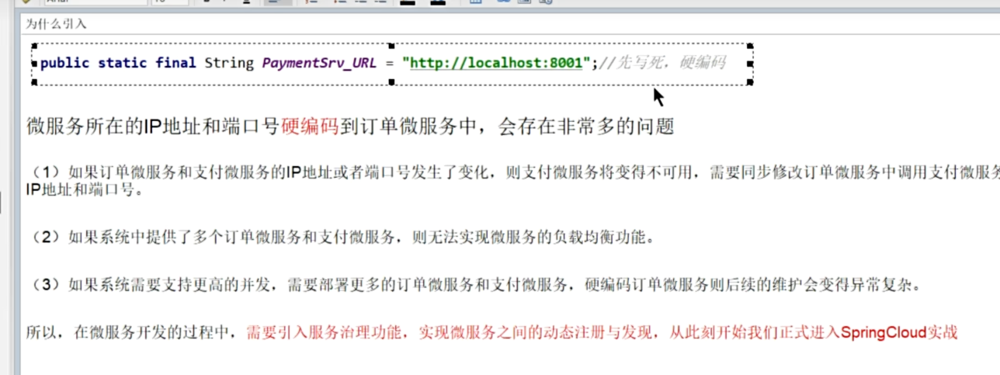
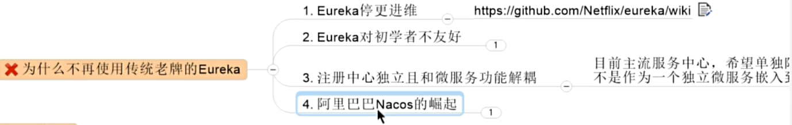
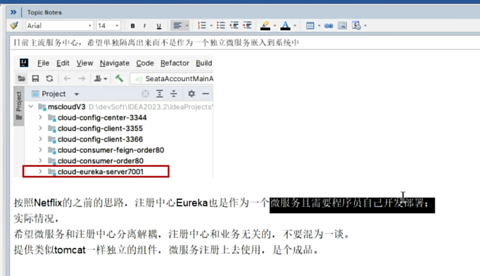
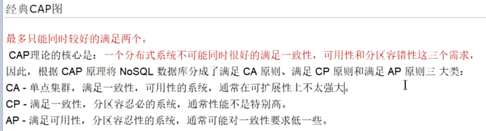
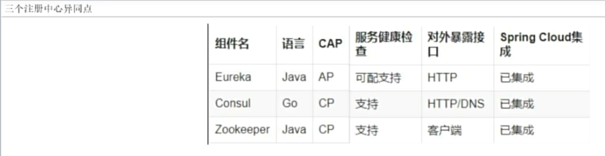
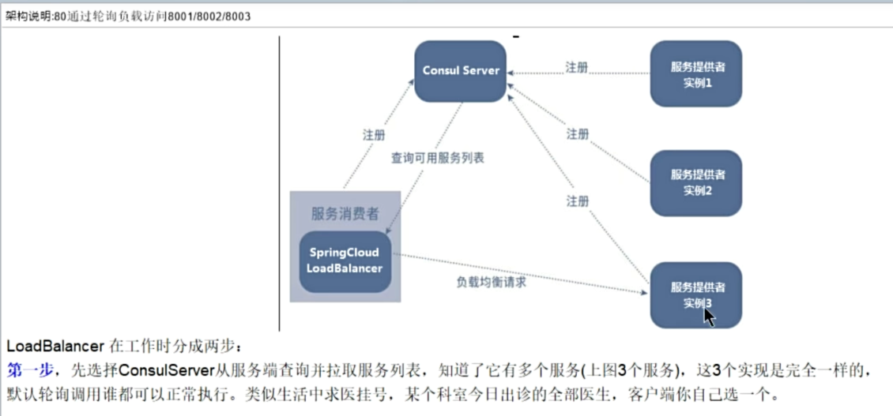

1.RestTemplate

官网地址：https://docs.spring.io/spring-framework/docs/5.2.2.RELEASE/javadoc-api/org/springframework/web/client/RestTemplate.html

2.consul服务注册与发现

不变的服务名称，可变的端口和地址

2.1 为什么引入服务注册中心

2.2为什么不再使用euraka
euraka，已经停止更新，耦合性高，不推荐使用

2.3 什么是consul
官网地址 https://www.consul.io/

下载，启动
consul agent -dev

客户端地址：
http://localhost:8500/ui/

注册中心异同点：
CAP: c ：一致性 a ：可用性 p ：分区容错性

2.4 LoadBalancer 负载均衡

bilibili
https://www.bilibili.com/video/BV1gW421P7RD?p=28&spm_id_from=pageDriver&vd_source=b48963aa425a963ced439cbddf94debd

