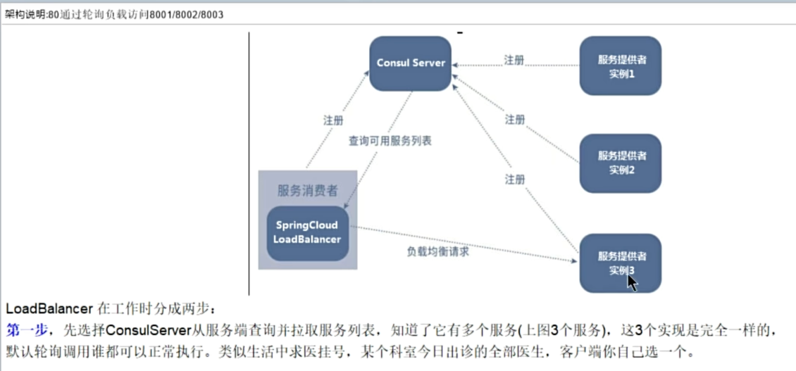

2.4 LoadBalancer 负载均衡

2.4.1持久化：
将配置文件写入本地文件进行读取
mac版本：
在 macOS 上配置 Consul 持久化存储，可以通过以下步骤来实现：
1. 安装 Consul首先，确保你已经安装了 Consul。如果没有安装，可以使用 Homebrew 进行安装：brew install consul
2. 创建数据目录为 Consul 创建一个数据目录，以便它可以将数据持久化存储在该目录中：mkdir -p /usr/local/consul/data
3. 配置 Consul创建或修改 Consul 配置文件，通常位于 /usr/local/etc/consul.d/config.json。确保配置文件中包含 data_dir 配置项。例如：{
   "data_dir": "/usr/local/consul/data",
   "server": true,
   "bootstrap_expect": 1,
   "bind_addr": "127.0.0.1",
   "client_addr": "0.0.0.0",
   "ui": true
   }
4. 启动 Consul使用配置文件启动 Consul：consul agent -config-file=/usr/local/etc/consul.d/config.json
5. 验证配置启动后，可以通过以下命令检查 Consul 是否正在运行，并查看持久化存储是否正确配置：consul members你还可以访问 Consul 的 Web UI（默认在 http://localhost:8500）来验证 Consul 的状态和配置。

负载均衡原理小结：
默认算法：轮询算法，随机算法

bilibili
https://www.bilibili.com/video/BV1gW421P7RD?p=28&spm_id_from=pageDriver&vd_source=b48963aa425a963ced439cbddf94debd

