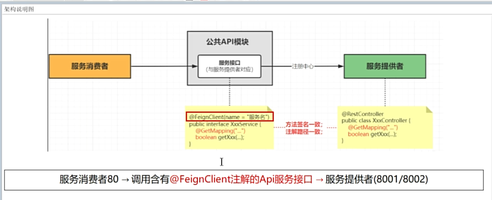
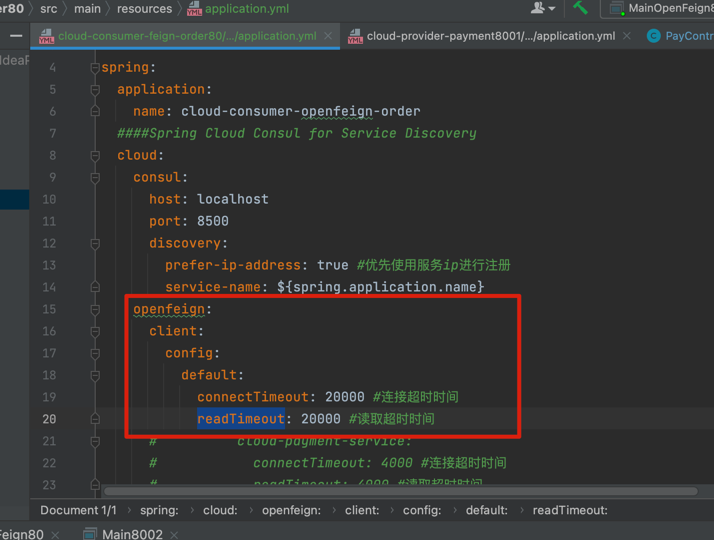
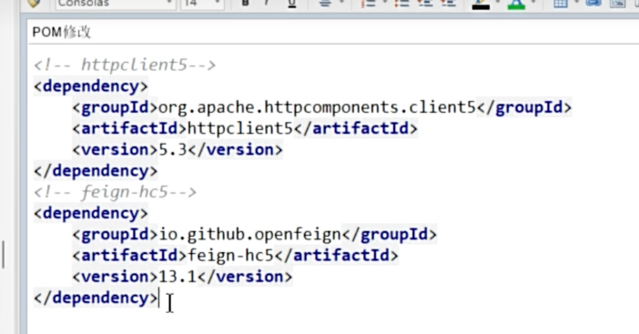
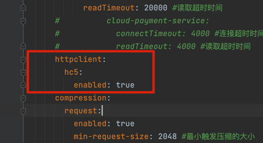
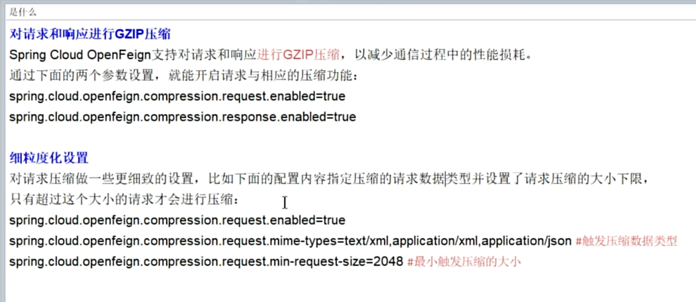
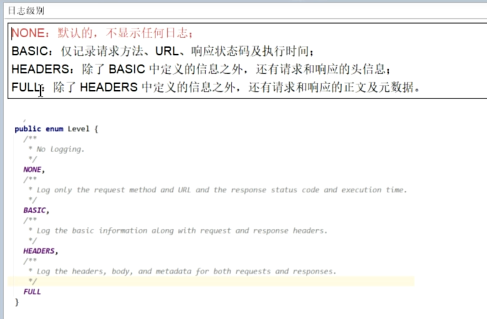

OpenFegin

简介：

实际开发中 loadBalancer用的不多，多用 OpenFegin

架构图：

超时控制：

全局配置：

指定配置：
只需要把default配置去掉，添加对应配置即可
如果两个配置都存在，回去找详细配置，就近原则

重试机制：
配置文件配置可设置重试次数，间隔时长

openApi优化HttpClient:

pom替换  

配置添加  

对响应请求进行压缩  

日志打印

config 添加文件后还需要 在 yml 文件中进行配置

