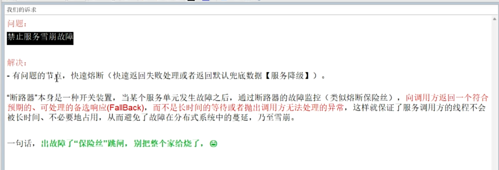
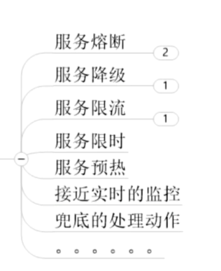
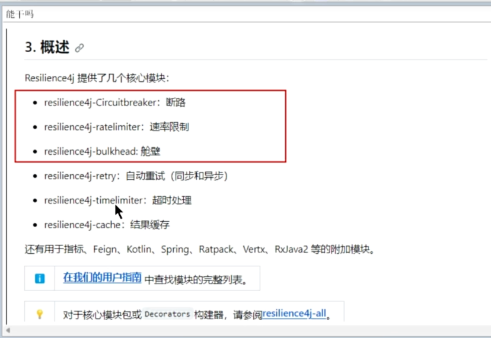
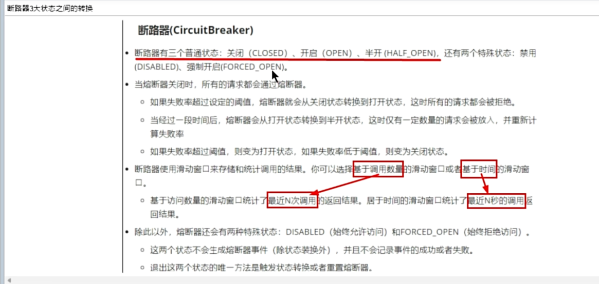
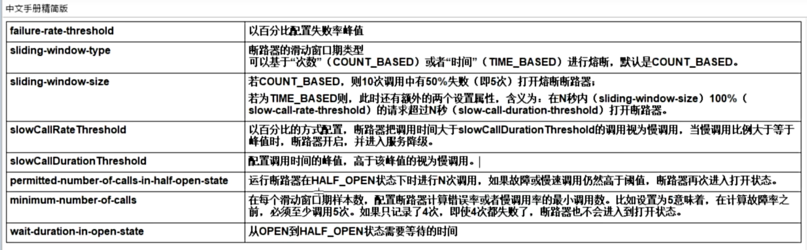
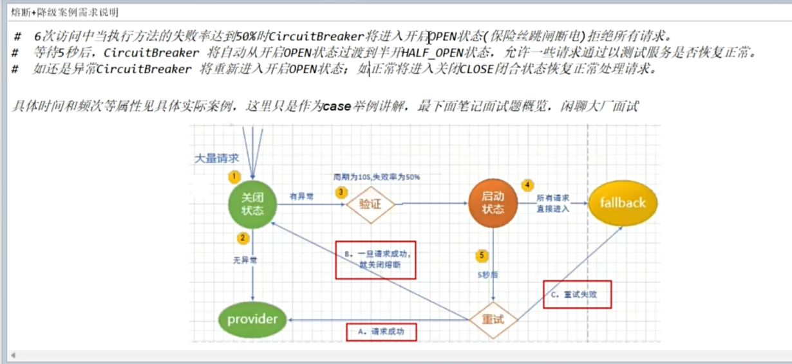
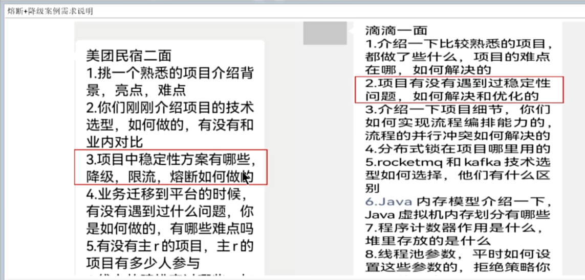
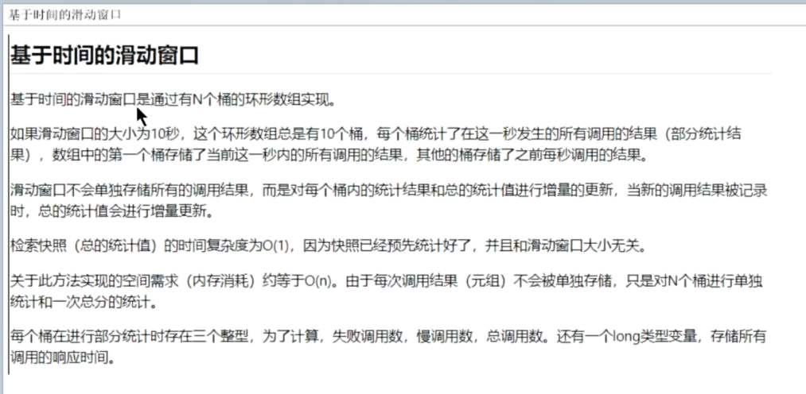
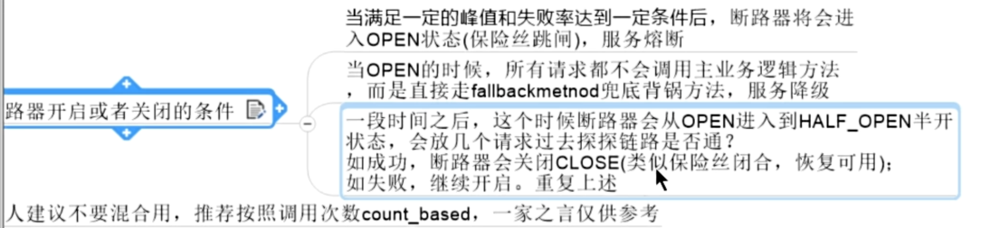

服务熔断

使用场景：多服务调用情况，一个服务挂掉之后，进行降级，防止影响到其他服务的调用

包含的内容：

circuitBreaker  断路器  它有两个具体实现：
Resilience4J
Spring Retry

resilience4j  

熔断器状态转换

配置详解：

例子：
其中 fallback 是指返回策略，例如返回一个 状态值

面试举例子

基于时间的配置

