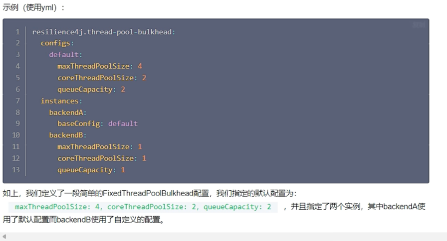

BulkHead 隔离

是什么

能干嘛

两种实现

SemaphoreBulkhead
原理

配置示例

ThreadPoolBulkhead
概述

配置示例

线程池原理

https://www.bilibili.com/video/BV1gW421P7RD/?p=54&spm_id_from=pageDriver&vd_source=b48963aa425a963ced439cbddf94debd

