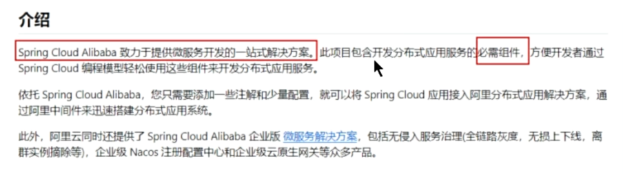
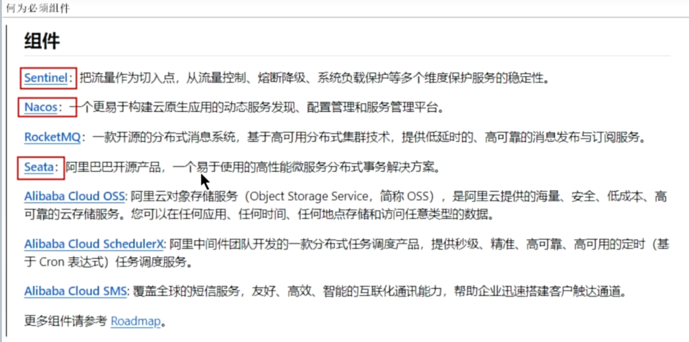
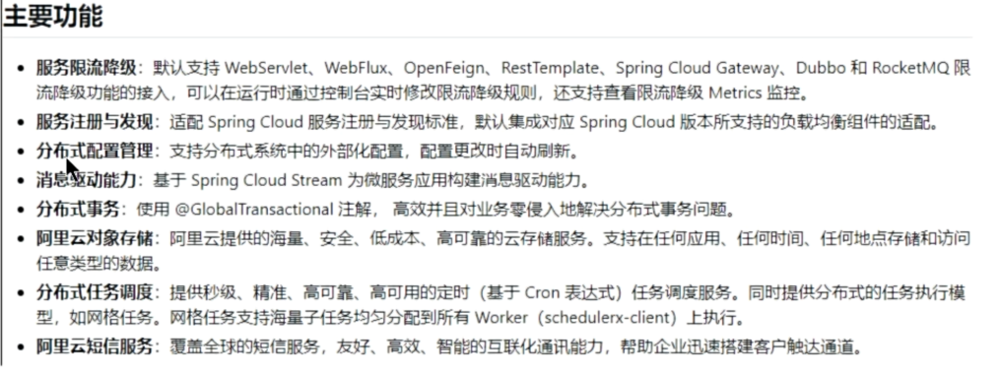
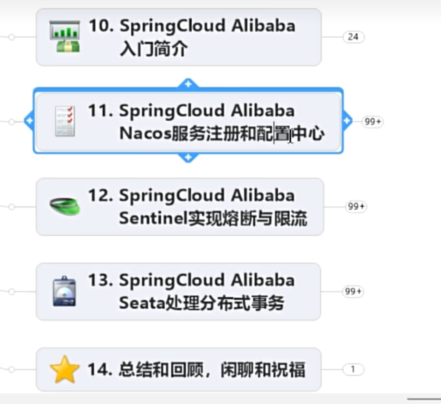

官方网址：
https://spring.io/projects/spring-cloud-alibaba

介绍

组件

主要功能

官方文档地址：
https://spring-cloud-alibaba-group.github.io/github-pages/2022/zh-cn/2022.0.0.0-RC2.html

spring cloud alibaba 相关组件

nacos 注册中心和配置中心
sentinel 熔断与限流
seata 分布式事务

