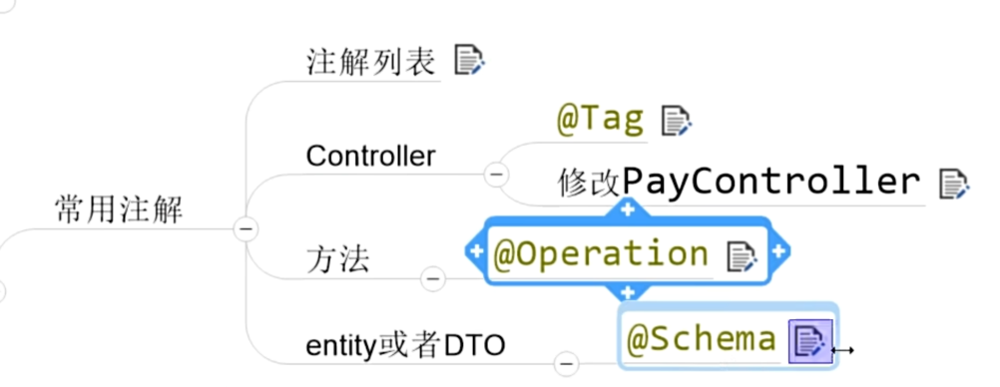

1.微服务架构
服务注册与发现
服务调用和负载均衡
分布式事务
服务熔断和降级
服务链路追踪
服务网关    
分布式配置管理

2.订单 -> 支付，业务需求说明

理念：
约定 > 配置 > 编码

流程：
2.1 idea新建Project和maven父工程
2.2 mapper3之一键生成
2.3 rest通用Bean工程构建
2.4 引入微服务理念，从这里开始

2.1 idea新建Project和maven父工程

2.2 mapper3之一键生成
使用mybatis_generator逆向工程生成相关文件

2.3 rest通用Bean工程构建

3模块建立流程

3.1 swagger3常用注解

3.2 时间格式问题
@JsonFormat(pattern = "yyyy-MM-dd HH:mm:ss", timezone = "GMT+8")

3.3 统一响应格式

状态码规范

3.4 统一返回对象

3.5 全局异常处理

使用全局配置或者单独 try catch，如果try catch 将不会进入全局异常处理

